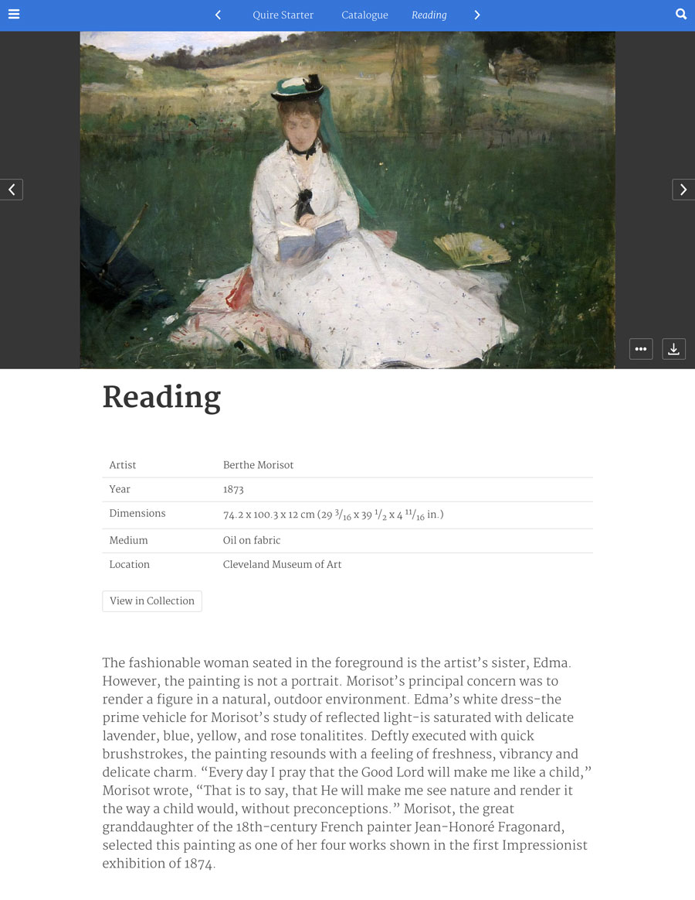
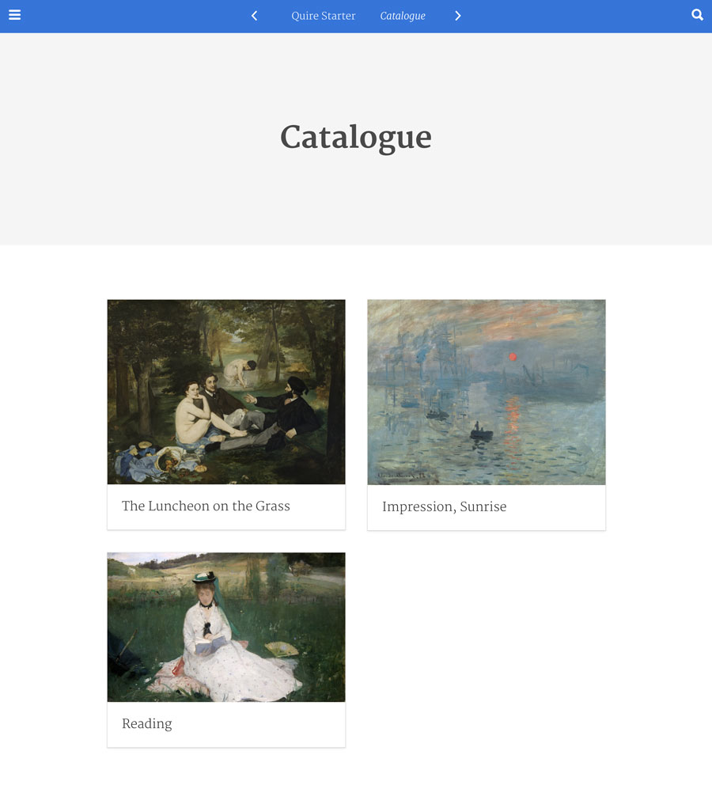

Along with monographs, edited volumes and serial publications, Quire is also designed with the publication of museum collection catalogues in mind and has a specific page `type` for them (See all page types in the [*Defining Page Types* section](text#defining-page-types) of the *Pages and Plain Text* page of this guide). Collection catalogues typically feature a page for each object, featuring images of the object, information about it, and an essay or entry text. To publish a catalogue with Quire, you’ll capture each object data, create the object pages, and then optionally, display a list of the objects included in your publication. Essays in object pages work in the same way as any other pages and you can visit our [*Markdown fundamentals*](../fundamentals/markdown) page for reference.

## Capturing Object Data

Much like `figures.yml` or `references.yml`, all catalogue object metadata should be captured in a single `objects.yml` file in the `data` directory of your project and then called as needed in different pages of your publication. Here is a brief sample:

```yaml
object_display_order:
  - artist
  - year
  - dimensions
  - medium
  - location
object_list:
  - id: 2
    title: Impression, *Sunrise*
    artist: Claude Monet
    year: 1872
    medium: Oil on canvas
    dimensions: 48 cm × 63 cm (18.9 in × 24.8 in)
    location: Musée Marmottan Monet, Paris
    link:
    figure:
      - id: "cat2"
  - id: 3
    title: Reading (portrait of Edma Morisot)
    artist: Berthe Morisot
    year: 1873
    medium: Oil on fabric
    dimensions: 74.2 x 100.3 x 12 cm (29 3/16 x 39 1/2 x 4 11/16 in.)
    location: Cleveland Museum of Art
    link: http://www.clevelandart.org/art/1950.89
    download: true
    figure:
      - id: "cat3"
      - id: "cat3a"
      - id: "cat3b"
```

There are two sections in the `objects.yml` file: `object_list` and `object_display_order`:

- The `object_list` is a list of the objects and their individual metadata attributes. With the exception of a few reserved terms, as noted in the table below, any attributes can be included here. These attributes and the associated values will ultimately display on the entry pages for each object.

- You control the specifics of which attributes to display and in what order, by listing them under `object_display_order`. Following the sample above, the attributes included on the pages would be: `artist`, `year`, `dimensions`, `medium` and `location`.

  Any images of the object are also included here, under the `figure` attribute. This is a list of one or or more images. It is recommended that this list be only of `id` values corresponding with `id`s in your project’s `figures.yml` file. However, if you prefer, you can instead include a `src` attribute with the filename as it appears in your project’s image directory.

Here are the only defined object attributes, you can include any others you like:

| Attribute | Description |
| --- | --- |
| `id` | Required. Used to reference objects from entry pages. Should be numbers and lowercase letters only, with no spaces or special characters (`001`, `fig-01a`, etc). |
| `figure` | A list of one or more images of the object. It is recommended that this list be only of `id` values corresponding with `id`s in your project’s `figures.yml` file. |
| `link` | A URL link to a page with more/current information on the object. Usually the object in the museum’s online collection pages. |
| `date_start`, `date_end` | Reserved for future use in Quire. |
| `dimension_width`, `dimension_height`, `dimension_depth` | Reserved for future use in Quire. |

## Creating Object Pages

Like all other pages in your publication, object pages are generated from the Markdown files in your `content` directory. To create an object entry page, give the page a `type: entry` in the page YAML block, and list one or more objects by `id` corresponding to those in your `objects.yml` file.

```yaml
type: entry
object:
  - id: 1
```

The page will feature any images associated with the object, followed by a table of object information and finally any essay/entry text included in the page Markdown file[&].



If you add multiple figures of the object, these are displayed in a rotating carousel, in the order they are listed in the object information in `objects.yml`. If any of the object figures have a `caption` and/or `credit`, they will be included as a pop-up window. And if the figure’s `download` attribute is set to `true`, a download icon will be included as well.

[note] In the table of object information, the items displayed and their titles are determined by the `object_display_order` attribute in the `objects.yml` file, as detailed in the section above. If the object information included a `link`, a “View in Collection” button is generated. The text of this button can be customized with the `objectLinkText` attribute in the project’s `config.yml` file.

## Generating Object Lists/Grids

In a collection catalogue, there will typically be a visual table of contents for just the catalogue entries. To create a page with a list or visual grid of all the object entries, the entries themselves need to be grouped in their own section. In Quire, this means putting them in a sub-directory within the main `content` directory (Read more about it in the [*Pages and Plain Text*](text) page of this guide).

In this example, inside the `content` directory, we have a folder called `catalogue` and inside that, three numbered entries and an overview page:

```
📁 catalogue
  📄 overview.md
  📄 1.md
  📄 2.md
  📄 3.md
```

The `overview.md` file is going to be our visual table of contents. To populate it, simply give it the attribute `type` a value of `contents` and the attribute `class` a value of  `"brief"`, `"list"`, `"abstract"`, or `"grid"` to determine the style. (The `"grid"` option will include an image from each entry page.) This `contents` page type will automatically generate from each of the Markdown files in the folder.

```yaml
title: Catalogue
type: contents
class: grid
slug: .
```



[Note] The `slug` value in the sample above, will change the URL of the page. Instead of being `/catalogue/overview` it will be simply `/catalogue`. Read more about the function of `slug` in the [*Pages and Plain Text*](text) page of this guide.
