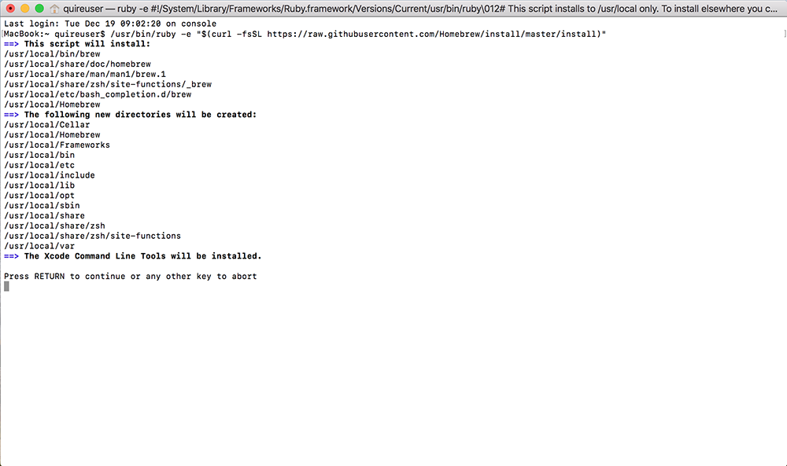
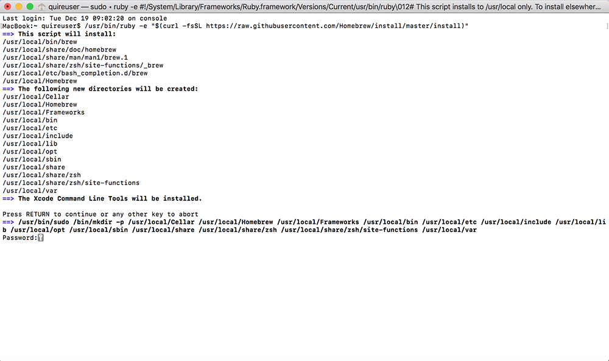
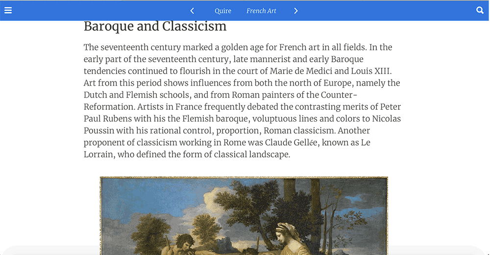

## Installing Quire and Its Dependencies

The most obvious difference between Quire and other publishing programs you may have seen, is that Quire operates without a graphical user interface (GUI), to make it look pretty. So, instead of pushing buttons or selecting from menus to make changes, you’re typing text.

This is working closer to the code. And to work with code, you need three standard coding tools. Before you start the install process. Set these up first:

1. Make sure you have a **command line shell**. Macs come with a good shell called **Terminal** (find it in your Applications > Utilities folder). For PCs we recommend installing **[Git Bash](https://git-for-windows.github.io/)**. A good introduction to the command line shell see [Introduction to the Bash Command Line](https://programminghistorian.org/lessons/intro-to-bash)lesson from the Programming Historian.
2. Set up a **[GitHub account](https://github.com/join)** and download **[GitHub Desktop](https://desktop.github.com/)** for version control.
3. Get a **text editor** (there are many, but we recommend [Atom](https://atom.io/) because of its integration with Github).


### Mac OS

*More steps than for a PC, but all pretty easy.*

Open your your Terminal command line application and one-by-one copy and paste the following commands. First to install support software for Quire, and then Quire itself:


1.) Check if you have Apple's Xcode 9 installed by copying and pasting the following command:

```
which xcode-select
```

And install **Apple’s Xcode** if you don’t already have it:

```
xcode-select --install
```

2.) Install **[Homebrew](https://brew.sh)**, which helps manage other installs:

```
/usr/bin/ruby -e "$(curl -fsSL https://raw.githubusercontent.com/Homebrew/install/master/install)"
```

As shown in the screenshots, you’ll need to press return/enter when prompted:



And enter your computer password when asked:


3.) Install **[Node.js 8.9.4 LTS](https://nodejs.org/)**:

```
brew install node
```
4.) Install **[Hugo](https://gohugo.io/)**:

```
brew install hugo
```

5.) Copy the **Quire CLI** (command line application) to your computer from GitHub:

```
git clone https://github.com/gettypubs/quire-cli.git
```

You’ll be asked to enter your GitHub username and password as you can see on the screenshot.


6.) Install the **Quire CLI**. Copy and paste the following commands and press return/enter twice:

```
cd quire-cli
npm install -g
```

7.) Add a Quire folder to your Home directory to keep your projects:

```
cd
mkdir Quire
```

### Windows

*Less steps than for a Mac, but the Hugo one in particular, is a bit tricky.*

1.) Download and install **[Node.js 8.9.4 LTS](https://nodejs.org/en/download/)**. You will have to restart your computer for Node to finish installing.

2.) Download and install **[Hugo](https://gohugo.io/getting-started/installing/#windows)** following the directions on their website. Note that for Windows 7 and 8 users, you will also need to install a **path editor**, such as the one from [codeplex](https://patheditor2.codeplex.com/).

Next, open your your Git Bash command line application and one-by-one copy and paste the following commands to install Quire:

3.) Copy the **Quire CLI** (command line application) to your computer from GitHub:

```
git clone https://github.com/gettypubs/quire-cli.git
```

4.) Install the **Quire CLI**:

```
cd quire-cli
npm install -g
```

5.) Add a Quire folder to your Home directory to keep your projects:

```
cd
mkdir Quire
```
Now you’re ready to install and run Quire. And don’t worry, you only have to do the installation once!


## Start a New Quire Project

In your command line shell, change directory (`cd`) into your Quire folder:

```
cd Quire
```

To start a new Quire project, you type `quire new` and then the name of your project. This will download the starter kit and starter theme:

```
quire new my-project-name
```

Then, simply change directory into your new project, and run `quire preview`:

```
cd my-project-name
quire preview
```

This will give you a live preview of your site, which you can view in any web browser at [http://localhost:1313](http://localhost:1313). To make changes, open your project folder in a text editor like Atom. When you make changes in the files, they’ll show up live on the localhost preview. You will see the changes you make on your site, except for the _config.yml_ files. Stop running the site locally by pressing `control-c`, make the changes and then restart the live preview to see the changes made on _yml_ files.


